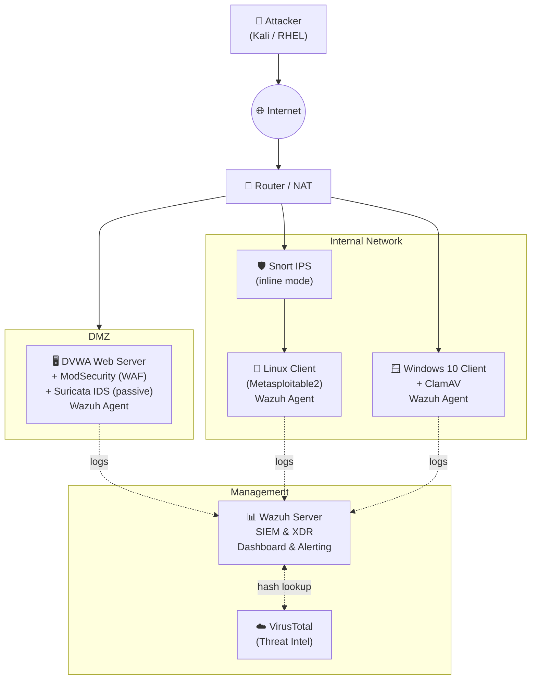

# Research and Deployment of Wazuh XDR for Network Security

> Building a unified detection & response (XDR) platform for a simulated enterprise network, using **Wazuh** as the core and integrating open-source security tools such as ModSecurity, Snort, Suricata, ClamAV, and VirusTotal.

This repository contains a hands-on study that designs a simulated enterprise network, deploys Wazuh XDR as a central monitoring platform, and validates its detection and automated-response capabilities across attack scenarios.

---

## Table of Contents

- [Overview](#overview)
- [Objectives](#objectives)
- [Architecture](#architecture)
- [Technology Stack](#technology-stack)
- [Lab Environment](#lab-environment)
- [Experimental Scenarios](#experimental-scenarios)
- [Key Results](#key-results)
- [Future Work](#future-work)
- [Repository Structure](#repository-structure)
- [Demo](#demo)
- [Author](#author)

---

## Overview

Modern enterprises face a fast-growing volume and sophistication of cyberattacks — from ransomware and phishing to APTs — while defending huge amounts of data spread across many platforms. Traditional defenses struggle with three recurring problems: slow detection and response, fragmented and poorly-integrated security tools, and a shortage of skilled analysts drowning in false-positive alerts.

**XDR (Extended Detection and Response)** addresses these challenges by unifying data collection, correlation and automated response across endpoints, network and applications, giving defenders a single, comprehensive view of the entire attack chain.

This project uses **Wazuh** — a free, open-source platform that unifies **SIEM** and **XDR** capabilities — as the backbone of that unified defense. Around Wazuh, several complementary security tools are integrated so that events from a web application firewall, network IDS/IPS, antivirus, file-integrity monitoring and threat-intelligence services all flow into one dashboard for centralized detection, correlation and automated response.

## Objectives

- Simulate a realistic enterprise network environment with multiple protected endpoints.
- Deploy Wazuh XDR as a centralized log-management, detection, and response platform.
- Integrate Wazuh with complementary security tools (ModSecurity, Snort, Suricata, ClamAV, VirusTotal, Teler, ELK).
- Design and execute attack scenarios to validate real-time detection, alerting, and **active response** (automated mitigation).
- Assess the effectiveness, strengths, and limitations of the Wazuh XDR approach.

## Architecture

The testbed consists of **7 virtual machines** modeling an enterprise network — protected endpoints (each running a Wazuh agent), an inline IPS, a NAT router, and an attacker host — all reporting to a central Wazuh server.



> The full editable diagram is available in [`WazuhXDR_Architecture.drawio`](./WazuhXDR_Architecture.drawio).

## Technology Stack

| Tool | Role in the project |
|------|---------------------|
| **Wazuh** | Core XDR/SIEM platform — agents, central server, dashboard, rules, active response, FIM, MITRE ATT&CK mapping |
| **ELK Stack** (Elasticsearch, Logstash, Kibana) | Collect, store, search and visualize log data behind the Wazuh dashboard |
| **ModSecurity** | Web Application Firewall (WAF) protecting DVWA from web attacks |
| **DVWA** | *Damn Vulnerable Web Application* — intentionally vulnerable target for web-attack testing |
| **Snort** | Inline IPS — detects and blocks abnormal network traffic (port scanning, ICMP flood) |
| **Suricata** | Passive IDS on the DVWA host — detects intrusions and raises alerts |
| **ClamAV** | Open-source, cross-platform antivirus on the Windows endpoint |
| **VirusTotal** | Online threat-intelligence service used for file-hash reputation lookups |
| **Teler** | Real-time HTTP intrusion detection integrated with Wazuh |
| **auditd** | Linux auditing framework used to collect executed commands for monitoring |

## Lab Environment

| Machine | Purpose | Security components |
|---------|---------|---------------------|
| **DVWA host** | Vulnerable web server (target) | ModSecurity (WAF), Suricata (passive IDS), Wazuh Agent |
| **Linux client** (Metasploitable2) | Vulnerable Linux endpoint | Protected by inline Snort IPS, Wazuh Agent |
| **Windows 10 client** | Windows endpoint | ClamAV antivirus, Wazuh Agent, FIM |
| **Snort machine** | Network intrusion prevention (inline) | Snort IPS |
| **Router** | NAT internal network ↔ Internet | — |
| **Attacker** | Simulated adversary | Kali Linux / RHEL, hping3, nikto, sqlmap-style payloads |
| **Wazuh server** | Central monitoring & response | Wazuh Manager, ELK, dashboard, active response |

## Experimental Scenarios

Eight scenarios demonstrate detection and automated response end to end:

| # | Scenario | What it demonstrates |
|:-:|----------|----------------------|
| 1 | **ModSecurity ↔ Wazuh** | Block common web attacks (SQL Injection, XSS) on DVWA; ModSecurity logs are forwarded to the Wazuh dashboard |
| 2 | **Snort ↔ Wazuh** | Restrict access to a predefined port range and detect an **ICMP flood** (100 packets/5s); Snort alerts surface in Wazuh |
| 3 | **Linux command monitoring** | Use `auditd` to capture executed commands and detect **privilege escalation** (vim GTFOBin), mapped to **MITRE ATT&CK** |
| 4 | **File Integrity Monitoring (FIM)** | Monitor a Windows 10 folder and log every add / modify / delete action |
| 5 | **VirusTotal integration & IoC** | Hash lookups against VirusTotal; auto-delete detected malware via active response; enrich ClamAV signatures and capture attacker IP/payload IoCs |
| 6 | **Blocking known malicious actors** | Wazuh **active-response** automatically blocks a malicious IP for 60 seconds across Windows and Ubuntu web endpoints |
| 7 | **Wazuh + Teler** | Detect web attacks (simulated with `nikto`) using Teler rules pushed to the Wazuh dashboard |
| 8 | **Suricata IDS + Wazuh** | Forward Suricata alerts to Wazuh to detect abnormal network behavior |

Each scenario is documented in detail — with descriptions, configuration and dashboard screenshots — in the [project report](./MajorProject_Report.pdf).

## Key Results

The project confirms that **Wazuh XDR is an effective and powerful platform for network security**. In the simulated environment it delivered:

- **Centralized log management** across all endpoints and security tools.
- **Real-time threat detection** with timely, accurate alerts.
- **Automated response** — e.g. auto-blocking malicious IPs and auto-removing malware — reducing reliance on manual intervention.
- **Broad coverage** by integrating ModSecurity, Snort, Suricata and ClamAV under one pane of glass, with MITRE ATT&CK context.

**Known limitations:** detection rules still need tuning to reduce false positives, and managing large volumes of log data at scale remains a challenge.

## Future Work

- **Deeper integration** with additional threat-intelligence feeds and security tools.
- **More automation** — automatic IP blocking, isolating compromised hosts, and applying machine learning to improve detection and cut false positives.
- **Advanced scenarios** — APT and ransomware simulations, plus IoT devices for broader coverage.
- **Documentation & training** — detailed guides and hands-on labs to help other teams deploy Wazuh XDR effectively.

## Repository Structure

```
MajorProject/
├── MajorProject_Report.pdf        # Full project report (Vietnamese)
├── WazuhXDR.pptx                  # Presentation slides
├── WazuhXDR_Architecture.drawio   # Editable network architecture diagram
├── Link video demo.md             # Link to the demo videos
└── README.md
```

## Demo

📹 Demo videos of the scenarios are available on Google Drive — see [`Link video demo.md`](./Link%20video%20demo.md).

---

<sub>This project was developed for academic and research purposes. All attacks were performed in an isolated lab environment.</sub>
